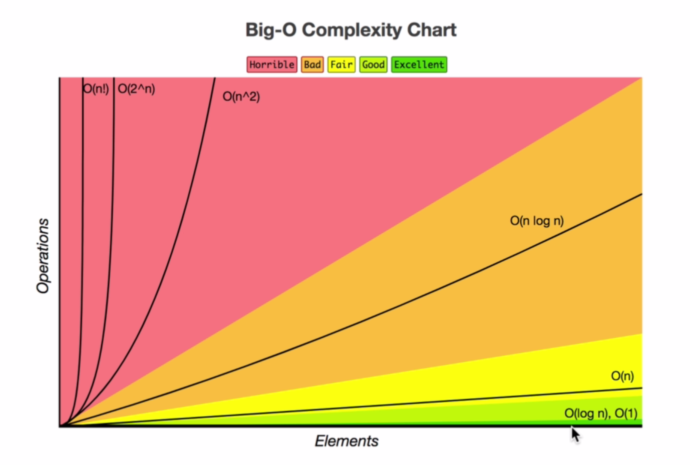

# Asymptotic analyis

> See more at: [bigO](https://www.bigocheatsheet.com/)

## Big O

**O(1)** - Constant - no loops  
**O(n)** - Linear - for while loops  
**O(n!)** - Factorial - you are adding a loop for every element  

> Iterating through half a collection is still O(n)  
> Two separate collections: O(a + b)

## Rule Book

- Worst Case
- Remove Constants
- Different terms for inputs
- Drop Non Dominants

## 3 Pillars of Programming

- **Readable**
- **Memory** - Space Complexity
- **Speed** - Time Complexity

## Causes space complexity

- Variables
- Data Structures
- Function Call
- Allocations
