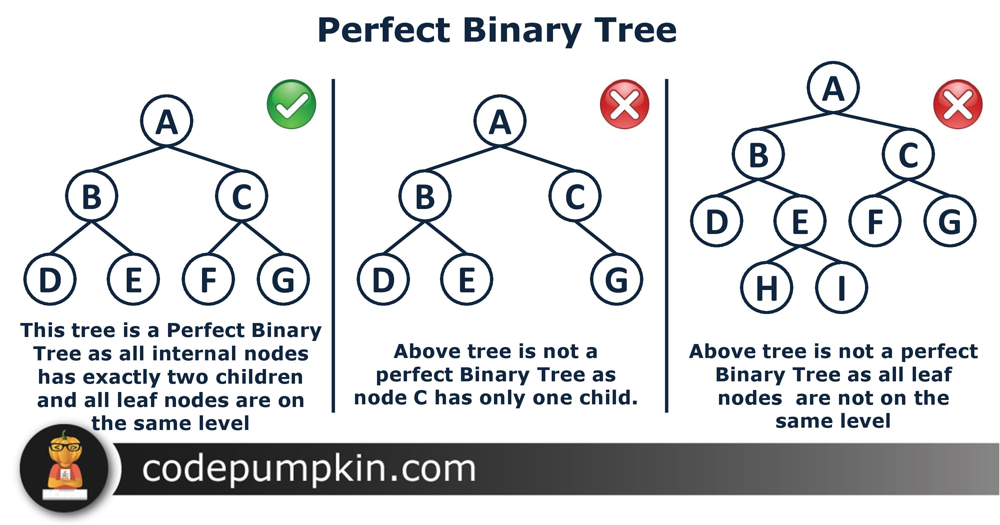

# Binary Tree :seedling:

## Binary Search Tree

| Method | Big O    |
| ------ | -------- |
| lookup | O(log N) |
| insert | O(log N) |
| delete | O(log N) |

- **level 0**: 2^0 = 1
- **level 1**: 2^1 = 2
- **level 2**: 2^2 = 4
- **level 3**: 2^3 = 8

| :grin:           | :slightly_frowning_face: |
| ---------------- | ------------------------ |
| Better than O(n) | No o(1) Operations       |
| Ordered          |
| Flexible Size    |

> \# of nodes = 2^h - 1  
> log nodes = steps
